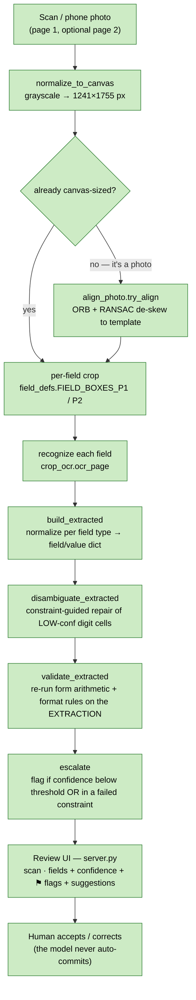
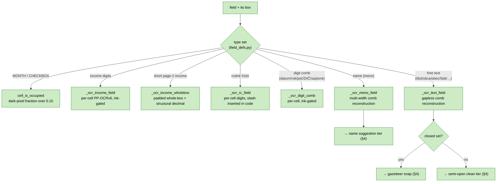
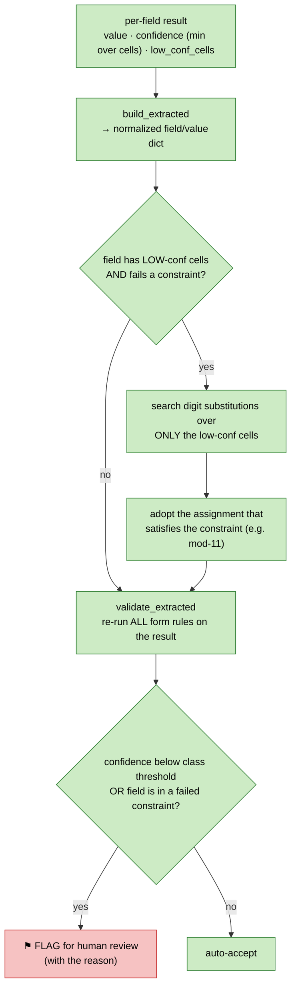
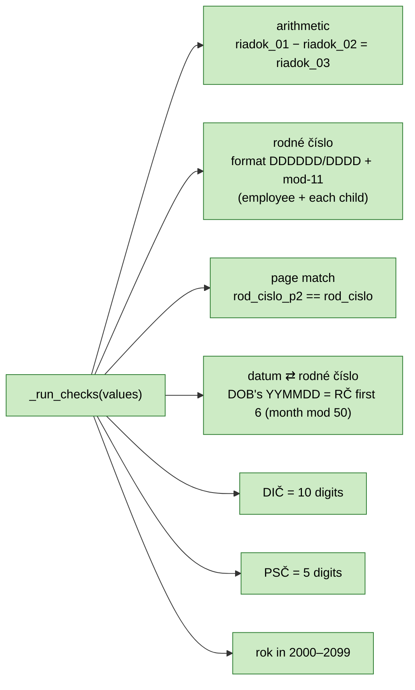
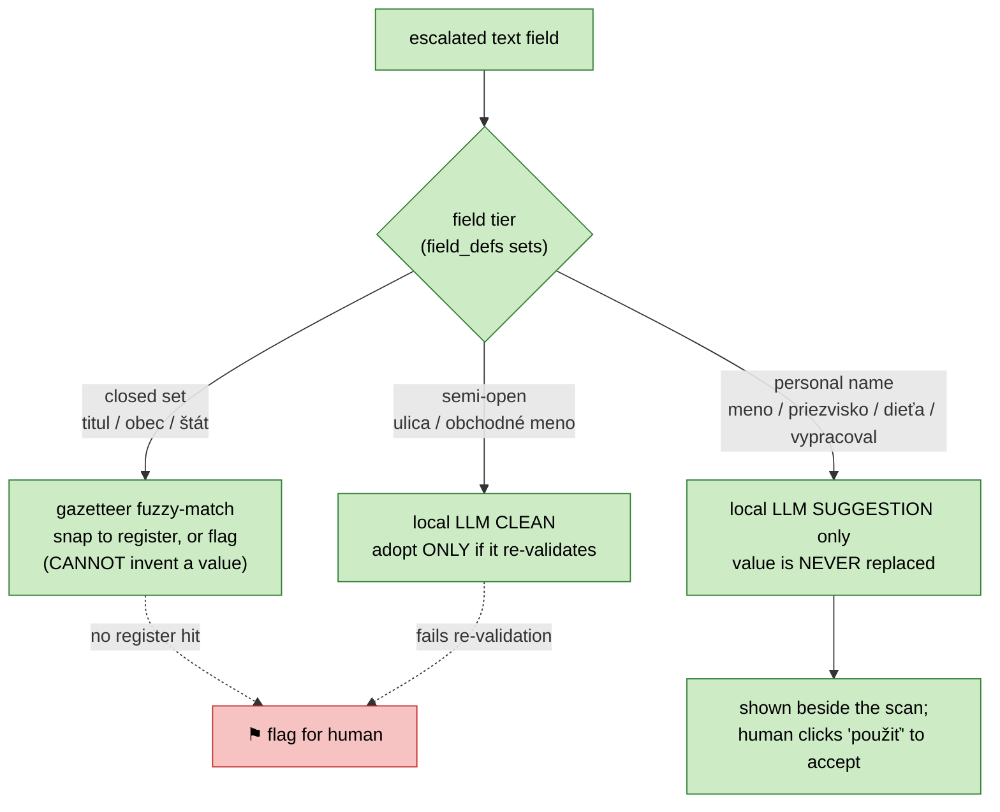
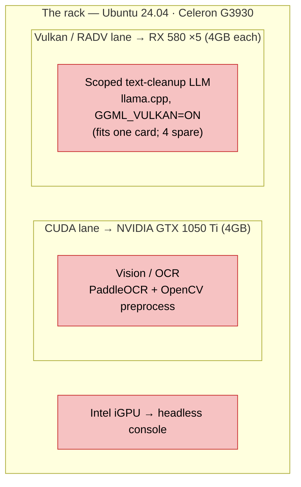
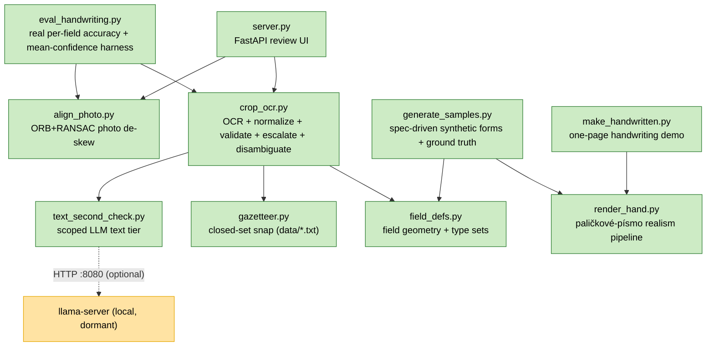

# ARCHITECTURE — POT395 extraction pipeline

How the app works **as built today**, in diagrams. For constraints, status,
roadmap, gotchas and dead-ends, read `CLAUDE.md` (the master doc). This file is
the visual map; `CLAUDE.md` is the operating manual.

**One paragraph:** A scanned/photographed Slovak income-tax form (POT395) comes
in; the page is normalized (and de-skewed if it's a photo); every field is cropped
by fixed coordinates and recognized by a per-type recognizer (digit OCR, ink
occupancy, or text OCR); the recognized values are normalized deterministically,
optionally repaired against form constraints, re-validated by form arithmetic +
format rules, and anything uncertain or inconsistent is **flagged for a human** in
a review UI. **The AI only perceives (OCR). All structuring and maths are
deterministic, and a human — never the model — gets the last word.**

Legend used below: 🟩 built & working · 🟥 not built (target/planned).

---

## 1. End-to-end pipeline



Key point: validation runs on the **extracted** values (to catch OCR errors), not
on the synthetic ground truth. `validate_gt` exists only as a generator self-test.

---

## 2. Per-field recognition routing

`ocr_page` dispatches each field to a recognizer based on its **type set** in
`field_defs.py`. The form is a fixed comb-boxed layout, so per-field crops beat
whole-page OCR.



**Two recognition models, by field type** (never mixed):
- `PP-OCRv6_medium_rec` — digits (the validated numeric path; ~100% on clean cells).
- `latin_PP-OCRv5_mobile_rec` — Slovak free text, full diacritic dictionary.

**The comb-reconstruction trick** (the breakthrough for free text): crop the
centre of each inked cell and paste them edge-to-edge into one word, then OCR that.
Whole-box OCR reads the printed comb dividers as junk (`Slovenská` →
`Astlolylelnlslkial`). For rodné číslo, the pre-printed `/` is never OCR'd — digits
are read per-cell and the `/` is inserted programmatically.

---

## 3. The robustness core (confidence → repair → validate → escalate)

This is the heart of the product — the human-in-the-loop story for a tax authority.



**HARD RULE (non-negotiable):** disambiguation may only vary cells that were
**low-confidence**. A field that is *high-confidence yet violates a constraint* is
**FLAGGED, never silently "corrected"** — a confident inconsistency may be a real
error on the taxpayer's form, which is exactly what a reviewer must see.

**Confidence thresholds** (`crop_ocr.CONF_THRESHOLD`, placeholders until real
handwriting recalibrates them):

| Class | Threshold | Why |
|---|---|---|
| numeric | 0.80 | validated by arithmetic/mod-11, so held to a higher bar |
| text | 0.70 | paličkové písmo is inherently noisier |
| occupancy | 0.30 | only marks near the 0.10 ink cutoff are uncertain |

---

## 4. Deterministic validation constraints

`validate_extracted` (and its self-test twin `validate_gt`) share one body,
`_run_checks`. Each failed check maps back to the field(s) it must flag.



These fire on the **extracted** values, so a dropped/misread digit that breaks the
form's own arithmetic gets caught and flagged.

---

## 5. Text-field rescue tiers (the only place an LLM lives)

Applies **only** to escalated (low-confidence) **text** fields. Numbers never enter
here — a digit misread loses the information at perception, and numerics are already
covered deterministically.



Rails: LLM is **LOCAL only** (taxpayer data sovereignty), grammar-constrained to
Slovak block letters, and **degrades gracefully** — if `llama-server` is down,
every text field falls back to gazetteer-plus-flag and the pipeline keeps running
(verified: identical accuracy with no server). `text_second_check.py` talks to
`llama-server` at `LLAMA_URL` (default `http://localhost:8080`) via
`/v1/chat/completions`. **Status:** code-complete but **dormant** until a model is
served — start one with `bash serve_llm.sh`.

---

## 6. Deployment: the two GPU lanes 🟥 (target — not yet built)

Today everything runs on **one laptop, OCR on CPU**. The deploy target ("the rack")
splits work across two physical GPU lanes that never touch each other:



- CUDA physically **cannot see** the AMD cards, so OCR lands on the 1050 Ti
  automatically. gfx803 has no modern ROCm — that's why GPU OCR is CUDA-only.
- **THE TRAP:** adding the NVIDIA card reshuffles Vulkan device indices. Pin the AMD
  lane's loader so NVIDIA disappears from its view and the indices stay stable:
  `VK_DRIVER_FILES=/usr/share/vulkan/icd.d/radeon_icd.x86_64.json`. (Full command
  and rationale in `CLAUDE.md`.)
- **Definition of done** runs the lanes concurrently: OCR form N+1 on NVIDIA while
  the text tier cleans form N on AMD.

---

## 7. Module map



| File | Role |
|---|---|
| `crop_ocr.py` | Core: per-field OCR, `build_extracted`, `validate_extracted`, `escalate`, `disambiguate_extracted`, gazetteer + LLM routing |
| `field_defs.py` | All field bounding boxes (1241×1755 canvas) + the type sets that drive routing |
| `gazetteer.py` | Fuzzy-snap closed-set text to `data/{stat,titul,obce}.txt` (cannot invent a value) |
| `text_second_check.py` | Phase-6 scoped LLM tier (clean / suggest); degrades to flag if no server |
| `align_photo.py` | ORB+RANSAC warp of a phone photo to the canonical canvas |
| `server.py` | FastAPI review UI: scan + fields + confidence badges + flags + name suggestions |
| `eval_handwriting.py` | Honest accuracy harness vs typed labels (the Phase-4 instrument) |
| `generate_samples.py` · `render_hand.py` · `make_handwritten.py` | Synthetic data generation (simulated paličkové písmo) |

---

## 8. Data shapes

Per-field OCR result (from `ocr_page`):

```text
{ "value": <digit/text string  OR  (dark_frac, occupied) for occupancy>,
  "confidence": <float, min over cells>,
  "low_conf_cells": [<indices below CELL_LOW_CONF=0.85>],
  "cells": [(char, score), ...],
  "gazetteer"?: {...}, "suggestion"?: str, "second_check"?: str }
```

`build_extracted` collapses these to the final `{field: value}` dict (occupancy →
bool, income → `"NNNNN.CC"`, rodné číslo → `"DDDDDD/DDDD"`, digit comb → digits,
text → stripped string), which is what validation, escalation and the UI consume.
