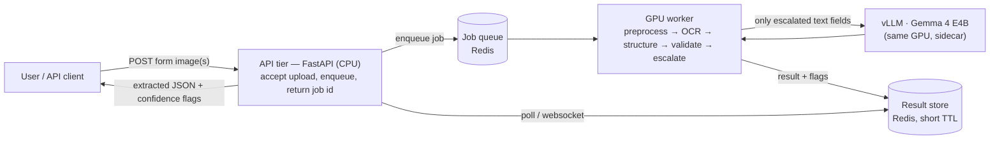
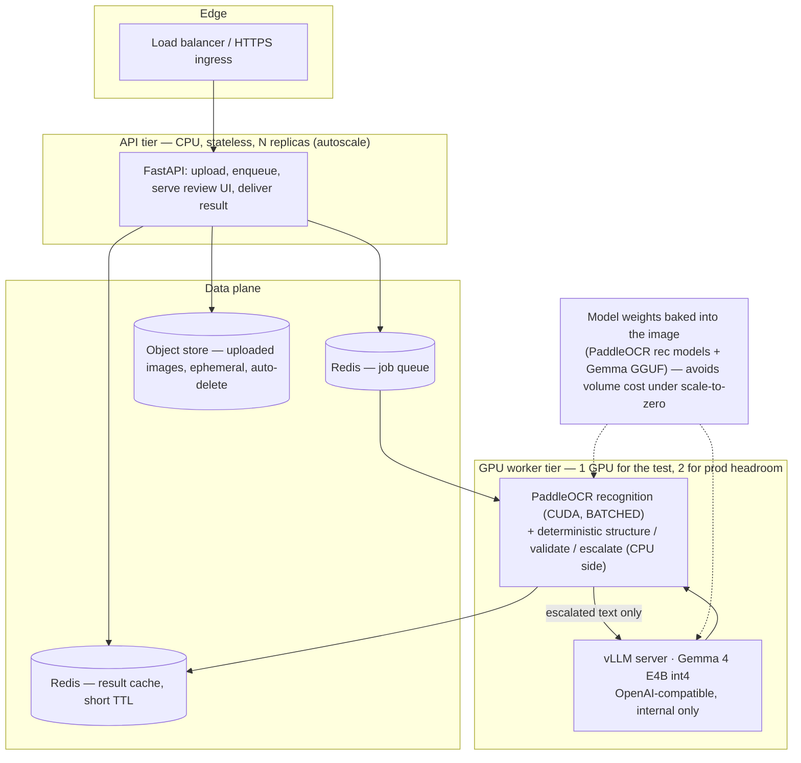

# DEPLOYMENT — cloud architecture & sizing (POT395 extraction)

Cloud deployment + scaling design for serving the pipeline to many users at once.
For how the pipeline works internally, see `ARCHITECTURE.md`; for project rules and
status, see `CLAUDE.md`. This doc covers: **app architecture · technical
architecture · sizing for 100 concurrent users (≤60s each) · optimal initial-test
sizing**, plus host options and a Fly.io quick-test appendix.

> **Scope of this version (decided with the owner):** the LLM (Gemma) stays in its
> **scoped text-cleanup** role — OCR + deterministic structuring do the real work,
> so **the thing under load is the OCR, not the LLM.** Data is **synthetic-only**
> for this test, so there is **no EU-residency hard requirement yet** (it becomes
> one for the real product — see §7). Target: a **durable GPU host**, with a Fly.io
> path you can run this week.

> **Date-sensitive facts (compiled 2026-06-28 — re-verify before spending):**
> - **Fly.io is sunsetting GPUs — unavailable after 2026-08-01.** Fine for a test
>   in the next few weeks; not a foundation. (§Appendix)
> - **Latest Gemma is Gemma 4** (E2B/E4B/12B-Unified/26B-A4B/31B). The ~4B-class
>   text-cleanup model is **E4B** (~4.5 GB int4 QAT). vLLM has day-0 Gemma 4
>   support (~Apr 2026). Gemma 3 4B QAT (~2.5–3 GB) still works and is more
>   battle-tested.

---

## 1. App architecture (what the user sees)

A user uploads one or two form images and gets back **extracted JSON + confidence
flags within 60 seconds**. Under the hood it's the same `ARCHITECTURE.md` pipeline,
but wrapped so 100 people can do it at the same time without anyone waiting >60s.

- **Typical single form is fast** (~1–3 s): OCR is sub-second, structuring is
  milliseconds, the LLM fires on at most a few text fields. The **60 s is the
  worst-case ceiling under a 100-form burst**, not the normal latency.
- The human-in-the-loop review UI (`server.py`) is the front-end; nothing about the
  "model never gets the last word" guarantee changes in the cloud.

---

## 2. Technical architecture (cloud topology)

Three tiers: a cheap stateless **API tier** (absorbs the upload burst), a **data
plane** (queue + result cache + ephemeral upload storage), and the expensive
**GPU worker tier** (OCR + the Gemma sidecar). The queue is what lets 100
simultaneous uploads drain through a small number of GPUs without dropping requests
or blocking users.

**Lane split (the important mental model):**
- **OCR lane = the load.** PaddleOCR recognition, ~300 inferences/form worst case.
  This is what the GPU count is sized for.
- **LLM lane = a sidecar.** Gemma 4 E4B int4 (~4.5 GB VRAM) co-located on the same
  GPU; it only fires on low-confidence *text* fields (often zero per form). It needs
  no dedicated GPU at this scale.
- **Everything else is cheap CPU:** upload handling, normalize/align, the entire
  deterministic structuring/validation/escalation path.

---

## 3. THE implementation change that makes the numbers work

The current `crop_ocr.ocr_page` calls the recognizer **once per cell, sequentially**
(`ocr_crop` → `rec.predict(one_crop)`). That is **batch-1**, and batch-1 is where
GPUs are slowest per item. At ~300 crops/form this is the difference between
comfortably meeting the SLA and blowing it:

| Mode | Per-crop latency (L40S-class, est.) | 300 crops/form | 100 forms on 1 GPU (serial) |
|---|---|---|---|
| Batch-1, FP32 (current code) | ~2 ms | ~0.6 s | **~60 s — at the SLA edge, no margin** |
| Batch-1, FP16/TensorRT (HPI) | ~0.7 ms | ~0.2 s | ~20 s — OK |
| **Batched (rec_batch_num 32–256), FP16** | — | — | **~6–10 s — huge margin** |

**Recommendation:** before load-testing, do two things to `crop_ocr`:
1. **Batch the recognition** — collect all inked cell-crops for a page (or across
   queued forms) and call `predict()` on the batch (PaddleOCR exposes `rec_batch_num`).
   This is the single highest-leverage change.
2. **Enable FP16/TensorRT** (PaddleX high-performance inference) on the GPU build.

With either, 1 GPU clears 100 concurrent forms well inside 60 s. Without batching,
you're relying on TensorRT + a bit of luck and should add a 2nd GPU.

---

## 4. Sizing for 100 concurrent users, ≤60 s each

**Workload (measured from `field_defs`):**
- ~**300 OCR inferences/form worst case** (259 digit-cell + 36 text-comb + 4 whole-box),
  ~**150–200 realistic** after ink-gating empty cells. Plus 80 occupancy checks that
  are numpy, not OCR.
- 100 forms arriving together → **30,000 inferences worst case** to finish in 60 s →
  **≥500 OCR recognitions/sec aggregate.**

**Throughput basis (be honest about confidence):**
- *Measured:* PP-OCRv5_mobile_rec ≈ **185 crops/s** batch-1 FP32 on a **T4**, ≈ **685
  crops/s** with TensorRT (PaddleX module benchmark, 2026).
- *Estimated:* batched on an L40S/A100 → **~5,000 crops/s** (safe planning number;
  could be 2–4× higher). **No vendor publishes batched L40S/A100 rec throughput — this
  is the #1 thing to benchmark yourself (§8).**

**Result:** even at the conservative 5,000 crops/s, 30,000 inferences = **~6 s of GPU
time**. So:

| Component | Test (synthetic) | Production-ish 100-concurrent |
|---|---|---|
| **GPU (OCR + Gemma sidecar)** | **1× L40S 48 GB** (or A100-80G) | **2× L40S** (headroom, p99, redundancy) |
| **vLLM Gemma 4 E4B** | co-located on the GPU (~4.5 GB) | co-located, or 1 dedicated cheap GPU if LLM use grows |
| **API tier (FastAPI, CPU)** | 1 small node (2–4 vCPU) | 2–3 autoscaled nodes behind a LB |
| **Queue + result cache** | 1 small Redis | 1 Redis (managed or 1 small node) |
| **Upload storage** | local/ephemeral | object store, auto-delete after result |
| **Worker concurrency** | batched OCR + 1–2 worker procs | batched OCR + worker pool per GPU |

**Why 1 GPU is enough for OCR:** the 100-concurrent/60s requirement needs ~500
crops/s; one batched GPU does an estimated ~5,000. The SLA is a *latency* ceiling, and
the backlog drains in seconds. The 2nd GPU in prod is for tail latency, deploys
without downtime, and a safety factor against the unbenchmarked throughput estimate —
not because one is too slow.

**Why Gemma needs no real sizing:** worst case ~6 escalated text fields/form × 100 =
600 short (≤16-token) generations in 60 s = ~10/s. E4B int4 does thousands of tok/s on
any of these cards. It is genuinely a rounding error on the GPU budget.

---

## 5. Optimal initial-test sizing (do this first)

**One box: 1× L40S (48 GB), running API + batched PaddleOCR + vLLM(Gemma 4 E4B int4).**

- Fits everything with room to spare: PaddleOCR rec models (~tens of MB) + E4B int4
  (~4.5 GB) ≪ 48 GB; the rest is KV-cache/OCR-batch headroom.
- L40S is the sweet spot: cheaper than an A100, plenty of VRAM, strong FP16.
- Cheapest reliable hosts for a synthetic test (per-second, can stop when idle):
  **Vast.ai L40S ~$0.47/hr** or **Runpod L40S ~$0.79–0.99/hr** (Runpod adds
  serverless scale-to-zero with ~500 ms cold start).
- **A full day of testing is a few dollars**; with scale-to-zero you pay per request.

**How to validate the test (don't trust this doc's estimates — measure):**
1. **Micro-benchmark the OCR**: run your real rec model on the target GPU with your
   actual crop-width mix and `rec_batch_num`, FP16 on → record real crops/s.
2. **vLLM**: `vllm bench serve` against the E4B endpoint for your escalation rate.
3. **End-to-end load test**: `k6`/`locust`, ramp to 100 concurrent uploads of
   synthetic forms, assert p99 end-to-end ≤ 60 s. Tune `rec_batch_num` + worker count.

---

## 6. Host options (durable; pricing as of 2026-06-28, verify live)

USD/hr on-demand unless noted. Prices move — re-pull before committing budget.

| Host | L40S 48 GB | A100 80 GB | Cheap mid card | Billing / notes |
|---|---|---|---|---|
| **Vast.ai** (cheapest) | ~**$0.47** | ~$0.74 | RTX 4090 ~$0.31–0.44 | per-second marketplace; interruptible ~50% less; verify in console |
| **Runpod** | $0.99 (secure) / ~$0.79 (community) | $1.39–1.49 | L4 $0.39 · A40 $0.44 · 4090 $0.69 | per-second; **serverless scale-to-zero**, ~500 ms cold start |
| **Lambda Cloud** | not offered | $2.79 | A10 $1.29 · A6000 $1.09 | per-minute; simple, pricier |

**Recommendation:** start on **Vast.ai or Runpod L40S**. Use Runpod serverless if you
want true scale-to-zero between bursts; Vast if you want the lowest sticker price and
will stop the box manually.

---

## 7. EU / data-residency (for the REAL product, not this test)

The moment real taxpayer data is involved, CLAUDE.md's "PII stays in a sovereign
location" rule applies and the host must be **physically in the EU**. Options (verify
prices; currencies not converted):

| Host | EU location | GPU & price |
|---|---|---|
| **Scaleway** | Paris / Amsterdam / Warsaw | L4 €0.79/hr · **L40S €1.47/hr** · H100 €2.73/hr — elastic, hourly |
| **Hetzner** | Germany / Finland | RTX 4000 SFF Ada 20 GB €184/mo · **RTX 6000 Ada 48 GB €838/mo** · RTX PRO 6000 Blackwell 96 GB €889/mo — dedicated boxes, monthly, manual provisioning |
| **OVHcloud** | Gravelines/Strasbourg/Frankfurt/Warsaw (EU) | L4 ~$1.00/hr · L40S ~$1.80/hr · H100 ~$2.99/hr (London/Canada are NOT EU) |

For a steady-state EU service, **Hetzner GEX130 (RTX 6000 Ada 48 GB, €838/mo)** is the
cost-leader if you can keep it busy; **Scaleway L40S** is the elastic, pay-per-hour
choice. This is a §-stub for later — the test doesn't need it.

---

## 8. What to benchmark before trusting this doc

These estimates are honest but not measured — verify the load-bearing ones:
- **Batched PaddleOCR rec throughput on the target GPU** — *unpublished anywhere*; the
  ~5,000 crops/s figure is extrapolated from T4 batch-1. **Everything downstream (GPU
  count) depends on this one number.** Measure it first.
- **End-to-end p99 under 100 concurrent** — load-test it; tune `rec_batch_num` + workers.
- **Current code is batch-1** — confirm the batching refactor (§3) lands before you
  judge throughput; un-batched, 1 GPU is at the SLA edge.
- **All host prices** are live snapshots (2026-06-28) and drift; Runpod community-vs-
  secure and Vast's marketplace rate especially. Re-pull before spending.

---

## Appendix — Fly.io quick-test (only before 2026-08-01)

Fly.io GPUs are **deprecated and gone after 2026-08-01**, but they work *now* and are
fine for a throwaway synthetic test this week.

- **SKUs / price (per-second, Fly):** A10 24 GB $0.75/hr · **L40S 48 GB $0.70/hr (`ord`)**
  · A100-40G $1.25/hr (`ord`) · A100-80G $1.50/hr (`iad`/`sjc`/`syd`/**`ams`**, the only
  EU one). Total = standard Machine (CPU+RAM) price + GPU price.
- **Scale-to-zero:** autostop/autostart supported; **stopped Machines cost nothing**,
  but **volumes are billed even when stopped** ($0.15/GB-mo) — so **bake the weights
  into the image** rather than a volume to stay free at idle.
- **Hard limits:** **1 GPU per Machine** (no multi-GPU / tensor-parallel), GPUs are
  US-mostly with Amsterdam the lone EU region.
- **Shape of a Fly test:** one `fly.toml` Machine with an `l40s` GPU running a single
  container (FastAPI + batched PaddleOCR + vLLM E4B), `auto_stop_machines = true`.
  Good enough to prove the 100-concurrent/60s number on synthetic forms — then move to
  a durable host (§6) because this platform is gone in weeks.
