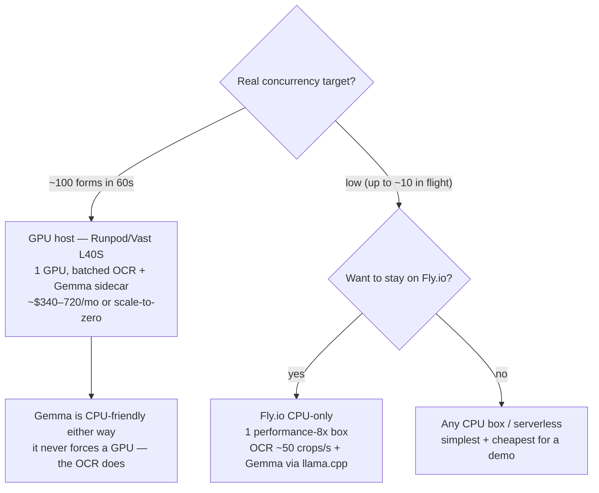

# DEPLOYMENT_PLAN — how to actually build & ship the cloud service

A concrete, phased plan to take the pipeline from "runs on one laptop" to "100
people upload a form and get extraction JSON back in under a minute." Companion to
`DEPLOYMENT.md` (the architecture + sizing reference); read that for the diagrams and
the host pricing. This file is the **plan + the CPU-vs-GPU decision** (including the
specific question: *can the models run CPU-only on Fly.io?*).

Scope assumptions (decided with the owner): Gemma stays a **scoped text-cleanup
sidecar**, data is **synthetic-only** for this test, target is **100 concurrent
uploads, each answered ≤60 s**, on a **durable GPU host** with a Fly.io fallback.

---

## 0. TL;DR

1. **The OCR is the workload; the LLM is a sidecar.** Size for PaddleOCR (~300
   inferences/form). Gemma 4 E4B int4 (~4.5 GB) rides on the same machine.
2. **One batched GPU clears 100×/60 s with margin.** The win comes from **batching the
   recognition calls** (the code is currently batch-1) — that's a code change, not a
   bigger GPU.
3. **CPU-only is viable but only at low concurrency.** For 100×/60 s, CPU needs a
   ~5–10-machine fleet that costs *more* than one GPU. The **LLM** alone is perfectly
   happy CPU-only. See §1 — this answers "can it run CPU-only on Fly.io?"
4. **Don't build on Fly.io GPUs** (gone after 2026-08-01). Use Runpod/Vast L40S; Fly is
   a this-week throwaway test only (CPU-only is even an option there for a demo).
5. **Measure before you trust any of this** — the batched OCR throughput on a real GPU
   is unpublished; benchmark it first (§3).

---

## 1. The compute decision: GPU vs CPU-only (and the Fly.io question)

The honest answer is **per-model**, because the two models have completely different
profiles.

### 1a. The LLM (Gemma 4 E4B) — CPU-only is fine, anywhere, including Fly

- It's small (~4.5 GB int4) and **low-QPS**: it only fires on *escalated text fields*
  (low-confidence names/streets), which is a handful per form and often **zero**.
- `llama.cpp` runs it CPU-only today (`serve_llm.sh` with `NGL=0`) — that *is* the
  current dev-box design. A short ≤16-token cleanup takes ~1–3 s on a few CPU cores;
  at this QPS one small machine covers 100 users.
- **Verdict: the LLM never forces a GPU.** If anything pushed you to a GPU, it's the OCR.

### 1b. PaddleOCR — runs CPU-only, but throughput is the catch

PaddleOCR **recognition-only works on CPU** (it's the documented laptop path — the full
detection pipeline has the oneDNN/PIR crash, recognition does not). So it *functions*
CPU-only. The question is whether it's *fast enough* and *cheap enough* at 100×/60 s.

**Measured CPU throughput** (PaddleX benchmark, mobile_rec, Xeon 8-thread, 2026):
**~47–58 crops/s per 8-vCPU machine** (≈ one crop every ~21 ms at batch-1).

**What the SLA needs:** ~300 inferences/form × 100 forms ÷ 60 s ≈ **500 crops/s** worst
case (~250/s realistic after ink-gating).

| | CPU-only (Fly or anywhere) | 1× GPU (L40S, batched) |
|---|---|---|
| Throughput/unit | ~50 crops/s per 8-vCPU box | ~5,000 crops/s (est.) per GPU |
| Units for ~500 crops/s | **~10 machines (≈80 vCPU)** | **1 GPU** |
| Units for ~250 crops/s (realistic) | **~5 machines (≈40 vCPU)** | 1 GPU (idles) |
| Rough always-on cost | **~$1.3k–2.6k/mo** (Fly perf vCPU ≈ $32/mo each) | **~$340–720/mo** (Runpod/Vast L40S) |
| Operational shape | fleet of boxes + load-spreading | one box |
| Single-form latency | ~5–6 s/form (fine for one user) | ~0.2–0.6 s/form |

**So, "can the models run CPU-only on Fly.io?"**
- **Gemma: yes, comfortably** — small, low-QPS, already CPU-designed.
- **PaddleOCR: yes it runs, but to meet 100×/60 s you need a ~5–10-machine CPU fleet
  that costs 2–4× a single GPU and is more to operate.** CPU-only is the *wrong economic
  choice at this scale.*
- **Where CPU-only IS the right call:** a **low-concurrency demo / MVP** (≤ ~10 forms in
  flight). At 10×/60 s you need ~50 crops/s → **one performance-8x Fly machine** runs
  OCR *and* the Gemma sidecar, dodges the GPU sunset entirely, and is dead simple. If
  the *real* Finančná správa load is "a few clerks at a time" rather than 100 truly
  simultaneous, **CPU-only on Fly is genuinely the simplest viable answer** — worth
  confirming the real concurrency before renting a GPU.
- Optimization that narrows the gap (but doesn't flip it): export the rec model to
  **ONNX/OpenVINO + INT8** and batch on CPU — realistically ~2× the crops/s/core. Still
  well short of a GPU per dollar.

---

## 2. Phase 1 — Make the code cloud-ready and fast

Two things stand between the current CLI and a service. Do these before renting anything.

### 2a. Batch the OCR (the single highest-leverage change)

Today `ocr_page` reads **one cell at a time**: `_ocr_cell → ocr_crop → rec.predict(one_crop)`.
That's batch-1, where GPUs are slowest per item (~300 sequential `predict()` calls/form).

**Change:** collect every inked crop for a page (ideally across queued forms in the
worker) into one list, call `predict()` once per batch, then scatter results back.

- `crop_ocr.ocr_crop` / `_ocr_cell`: keep as the per-crop path, but add a
  `rec.predict(list_of_arrays, batch_size=N)` route.
- `_ocr_income_field` / `_ocr_rc_field` / `_ocr_digit_comb` / `_ocr_comb_text`: instead
  of looping `predict` per cell, **emit their inked crops + a key** (field, cell index),
  let `ocr_page` gather all of them, run **one batched predict**, and reassemble the
  `(text, score)` results into the existing per-field result dicts.
- PaddleX `create_model(...).predict()` accepts a list and has a batch size — no new
  dependency.
- Turn on **FP16 / TensorRT** (PaddleX high-performance inference) on the GPU build.

Expected effect (from §1 numbers): batch-1 FP32 on 1 GPU is ~60 s at 100× (the edge);
batched FP16 drops the per-form OCR to a fraction of a second → **1 GPU with big margin.**
*Don't change recognition logic or thresholds — this is purely how crops are dispatched.*

### 2b. Wrap it in an async service

- Keep `server.py` as the API, but make `/api/extract` **enqueue a job and return a job
  id** instead of doing the work inline (so 100 uploads don't block).
- Add a **Redis job queue** + a **worker process** that pulls jobs, runs the batched
  pipeline, and writes the result to a short-TTL Redis key.
- Client gets the result by **poll or websocket** (the review UI already polls-friendly).
- `build_extracted / validate_extracted / escalate / disambiguate` are unchanged — they
  run in the worker after OCR.

### 2c. One container image

- Bundle FastAPI + PaddleOCR (GPU build) + `vllm` (or `llama.cpp`) + the **model weights
  baked in** (PaddleOCR rec models + Gemma E4B GGUF). Baking weights avoids paying for a
  persistent volume under scale-to-zero.
- One image can run as either role (API / worker) via an entrypoint flag, or split.

---

## 3. Phase 2 — Benchmark (measure the unknowns, don't trust the estimate)

The "1 GPU is enough" conclusion rests on an **unpublished** number. Validate it:

1. **OCR micro-benchmark:** run the real rec model on the target GPU with your actual
   crop-width distribution and `rec_batch_num`, FP16 on → record true **crops/s**.
   This is the #1 number; everything (GPU count) depends on it.
2. **vLLM:** `vllm bench serve` against the E4B endpoint at your real escalation rate
   (a few short generations per form).
3. **End-to-end load test:** `k6` or `locust`, ramp to **100 concurrent** uploads of
   synthetic forms; assert **p99 end-to-end ≤ 60 s**. Tune `rec_batch_num` + worker count.
4. Record the numbers back into `DEPLOYMENT.md` §4 (replace the estimates with measurements).

---

## 4. Phase 3 — Deploy to a durable GPU host

- **Host:** Runpod L40S (~$0.79–0.99/hr, per-second, serverless scale-to-zero) or Vast.ai
  L40S (~$0.47/hr, cheapest). Start with one GPU.
- **Deploy:** push the container; one GPU machine running API + batched OCR + vLLM; a
  small Redis (managed or a tiny box).
- **Re-run the load test on the real host.** Confirm p99 ≤ 60 s at 100×. Add a 2nd GPU
  only if the measured throughput says so (headroom / tail latency / zero-downtime deploys).
- **Cost control:** scale-to-zero between bursts (Runpod serverless) so a synthetic test
  costs a few dollars, not a monthly GPU rental.

---

## 5. Phase 4 — Fly.io quick test (optional, only before 2026-08-01)

If you want to prove it on Fly this week:
- **GPU path:** one Machine with an `l40s` GPU (`ord`), `auto_stop_machines = true`,
  weights baked into the image (volumes bill even when stopped). Gone after Aug 1.
- **CPU-only path (the §1 demo option):** one `performance-8x` Machine, no GPU, running
  batched OCR + Gemma via `llama.cpp`. Good for proving correctness and a *low*-concurrency
  demo; will not hit 100×/60 s alone. This is the version that *survives* the GPU sunset.

Either way, treat Fly as throwaway and move the scaled service to §4.

---

## 6. Phase 5 — Production hardening (when real data enters)

This is gated on real (non-synthetic) data, which flips on CLAUDE.md's sovereignty rule:
- **EU-resident GPU host** (Scaleway Paris L40S €1.47/hr, or Hetzner Germany RTX 6000 Ada
  €838/mo). No US hosts for real taxpayer PII.
- Encryption in transit + at rest; **auto-delete uploads** after the result; no PII in
  logs; retention policy.
- AuthN/AuthZ on the API; audit trail for who reviewed/accepted what.
- Real load + soak testing; autoscaling policy; on-call/alerting.
- Keep the local-only LLM rail: Gemma stays on *your* infra, never a third-party API.

---

## 7. Sequencing — what to do first

| Order | Step | Why first |
|---|---|---|
| 1 | **Confirm the real concurrency target** | If it's ~10 not 100, §1 says CPU-only on Fly is the whole answer — skip the GPU work. |
| 2 | **Batch the OCR (2a)** | Biggest speedup, needed before any benchmark is meaningful. |
| 3 | **OCR micro-benchmark (3.1)** | Turns the load-bearing estimate into a real number → fixes the GPU count. |
| 4 | **Async wrap + container (2b/2c)** | Makes it deployable. |
| 5 | **Deploy + load test on Runpod/Vast (4)** | Proves 100×/60 s on real hardware. |
| 6 | Fly quick test (5) / EU hardening (6) | Optional / later. |

---

## 8. Open questions & risks

- **Is it really 100 concurrent?** The single biggest lever. A government back-office may
  process forms at far lower true concurrency, which would make **CPU-only the right
  answer** and delete the GPU entirely. Worth confirming before spending.
- **Batched OCR throughput on L40S/A100 is unmeasured** — the ~5,000 crops/s is an
  extrapolation. Benchmark (3.1) before trusting the 1-GPU conclusion.
- **Accuracy is still synthetic-only** (CLAUDE.md Phase 4). Scaling a pipeline that hasn't
  been validated on real handwriting is premature for *production*; fine for a *load test*.
  Don't let "it scales" be mistaken for "it reads real forms."
- **All host prices are 2026-06-28 snapshots** and drift; re-verify before committing.
- **Gemma 3 vs Gemma 4:** E4B is "latest" but newer; Gemma 3 4B QAT is more battle-tested.
  Either fits CPU or the GPU sidecar — pick on a quick quality spot-check, not on infra.
