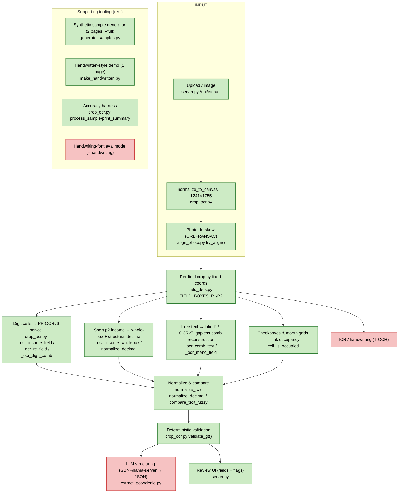
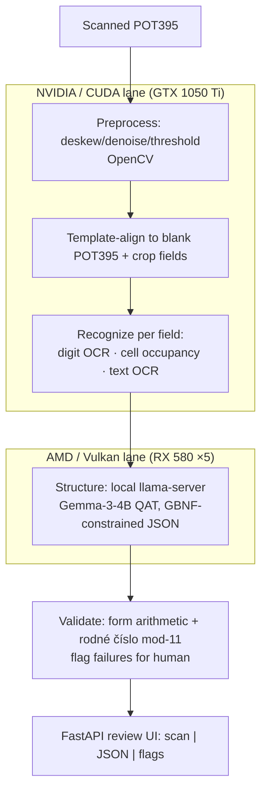

# STATUS — POT395 extraction pipeline (as built)

This is the honest state of the code, not the plan. Read it before trusting any number.

**One-line truth:** A deterministic OCR + rules pipeline for both pages of the POT395 form,
reaching ~99% on **synthetic samples it generates itself in a printed font**. The LLM-structuring
half of the intended architecture does not exist, and the system has never been meaningfully
tested on real handwriting.

---

## 1. Pipeline as actually built

Legend: 🟩 done · 🟨 stubbed · 🟥 not started. There are currently **no stubs** — things are
either built or absent. `H` (LLM structuring) and `E5` (ICR) are the two not-started stages;
`S4` (handwriting font for fair ICR eval) was planned and handed to a cloud refinement step.

---

## 2. Target architecture (from CLAUDE.md)

The defining feature of the target is **two physical GPU lanes** (CUDA vision + Vulkan LLM
structuring) running concurrently. **Neither lane exists as designed** (see §6).

---

## 3. Real vs mocked

**Real and working:**
- Field geometry for both pages in `field_defs.py` — measured by eye off the rendered template.
- Two PaddleOCR recognition models: `PP-OCRv6_medium_rec` (digits) and
  `latin_PP-OCRv5_mobile_rec` (Slovak text). Both genuinely run and are downloaded.
- Per-cell digit OCR, gapless comb-text reconstruction, checkbox occupancy — all real algorithms.
- Deterministic validation (`validate_gt`): r01−r02==r03 arithmetic, rodné-číslo mod-11 (employee
  + 4 children + page-2 copy), PSČ 5-digit, rok range, dátum↔rodné-číslo cross-check, page-1↔page-2
  rodné-číslo match, DIČ 10-digit. These fire correctly on intentionally-broken samples.
- ORB photo alignment (`align_photo.py`) and its server integration (`try_align`).
- FastAPI review UI (`server.py`) — both pages, all field sections, validation panel.

**Mocked / simulated / not what it looks like:**
- **"Handwriting" is a printed monospace font** (Liberation Mono) with rotation, blur, and
  salt-pepper noise (`make_handwritten.py`, `generate_samples.add_scan_noise`). It is **not**
  real handwriting. Every accuracy number below is against this.
- **Ground truth is self-generated.** The pipeline is graded against data the generator drew —
  draw and read share the same coordinates, so geometry errors can hide.
- **No GPU OCR.** `paddlepaddle` is the CPU build; the present RTX 5060 is unused by OCR.
- **No LLM anywhere.** Structuring is plain Python rules, not a model. (This trivially satisfies
  "the model never gets the last word" — there is no model in that step.)
- The "rack" (1050 Ti + 5× RX 580, Vulkan llama.cpp) was never present; everything ran on one
  laptop. `bootstrap.sh`'s llama.cpp/Vulkan/Gemma section was never executed.

---

## 4. Accuracy numbers (all on synthetic, printed-font samples)

| Scope | Result | Notes |
|---|---|---|
| Both pages, 8 samples, 129 fields each | **99.1% (1023/1032)** | current headline |
| Page 1 only (38 fields) | 98.0% | after uppercase + Slovak-alpha filter |
| Fully-filled sample (`--full`, 130 fields) | 97.7% (127/130) | |
| rodné číslo | 0% → **100%** | was cropping declaration text; fixed by relocating + per-cell + programmatic "/" |
| Income riadok_01–09, digit combs, checkboxes, month grids | ~**100%** | |
| Child rodné čísla (×4) | **100%** | |
| Employer block (DIČ, address, name) | **100%** | |
| meno_zamestnanca | 62.5% → ~**87–100%** | gapless reconstruction + despaced/edit-1 fuzzy |
| p2_riadok_12 (8-digit box) | **87.5%** | occasional digit misread |
| dieta_meno (child name) | ~**87%** | long names overflow the 11-cell box (data, not OCR) |
| datum_narodenia | ~**75%** | faint last year digit crowds margin text; redundant + cross-checked |
| Phone-photo (simulated, tilted) | garbage → readable | only after `try_align`; ~1 digit slips from warp blur |

**Caveat that matters more than the table:** these reflect recognition of a clean printed font
under mild synthetic noise. Real pen handwriting (paličkové písmo) is a different, harder problem
the printed-text models are not built for; the one real-handwriting attempt this session garbled
until it was understood the user wrote over a pre-filled form. **Treat 99% as "the plumbing
works," not "it reads real forms."**

---

## 5. Key decisions & dead-ends

**Decisions that stuck:**
- **Two recognition models, by field type.** Digits on PP-OCRv6 (never routed through latin);
  text on latin PP-OCRv5. Mixing regresses the validated numeric path.
- **Gapless comb-text reconstruction** (the breakthrough for free text): crop the centre of each
  inked cell, paste edge-to-edge, OCR the rebuilt word. Whole-box OCR reads the comb dividers as
  junk ("Slovenská"→"Astlolylelnlslkial").
- **Per-cell digit OCR + programmatic "/"** for rodné číslo (the "/" was systematically misread).
- **Whole-box + structural decimal** for the small page-2 income boxes; per-cell was too fragile
  on faint isolated digits. The 8-digit riadok_12 stays per-cell.
- **Uppercase samples (paličkové) + Slovak-alphabet filter + diacritic-insensitive, edit-distance-1
  fuzzy match.** Case-insensitive throughout.
- **±1° max synthetic rotation** (row borders bleed into adjacent cells beyond that).
- **normalize_to_canvas** (any input size) + **ORB alignment** (photos).

**Dead-ends / things that wasted time:**
- **Guessing coordinates from blind pixel scans** — repeatedly wrong (rodné číslo, name, súpisné,
  datum). The fix every time was to *view* the rendered form. Lesson baked into memory.
- **Whole-box OCR for rodné číslo** → 0% (the "/").
- **Median filter / autocontrast preprocessing** on faint digits → made it worse.
- **Per-cell OCR on small faint income boxes** → digit-dependent misreads (566→116).
- **TrOCR** was offered, declined, then re-requested as the ICR lane — now planned, not built.

---

## 6. Where the build diverges from CLAUDE.md

1. **No LLM structuring lane.** CLAUDE.md step 4 (local `llama-server`, Gemma-3-4B QAT,
   GBNF-constrained JSON) and `extract_potvrdenie.py` **do not exist**. Structuring/validation is
   deterministic Python (`validate_gt`). This is arguably *better* for correctness, but it is a
   straight-up departure from the documented architecture.
2. **No two-GPU split.** The CUDA-vision / Vulkan-LLM concurrency that defines the target is not
   implemented. Ran on one laptop; OCR is CPU PaddleOCR; the AMD/Vulkan lane is untouched.
3. **Extra model not in the spec.** Added `latin_PP-OCRv5_mobile_rec` for Slovak diacritics — the
   spec assumes one OCR setup.
4. **Diacritics "prioritise numbers" guidance** followed in spirit: numbers are exact and validated;
   diacritics are best-effort + fuzzy. But true handwritten-diacritic capture is unsolved (ICR TODO).
5. **Hardware notes are theoretical.** The Vulkan device-enumeration trap, the GPU lanes, the
   PaddleOCR-GPU swap — none verified on real hardware this session.
6. Consistent with CLAUDE.md: synthetic-data-only ✓, template-align + per-field crop ✓,
   deterministic validation flags for humans ✓, FastAPI review UI ✓.

---

## 7. What's incomplete (blunt)

- **Never validated on real handwriting.** The headline accuracy is against a printed font the
  code drew itself. Expect substantially worse on scanned pen-filled forms.
- **No ICR/HTR.** Hand-printed text relies on printed-text models; a TrOCR lane is planned only.
- **No LLM structuring, no GBNF, no `extract_potvrdenie.py`.** Half the documented pipeline.
- **No GPU acceleration** for OCR; the two-lane rack architecture is unbuilt and untested.
- **IV. ODDIEL free-text notes** (the genuinely unstructured block) is not extracted at all.
- **Field coordinates are hard-coded to one 150-DPI render** of the template; robustness to other
  scans leans entirely on the ORB aligner, tested only against one simulated photo.
- **Weak fields** remain: datum_narodenia (~75%), long child names (truncated by box width),
  p2_riadok_12 (87.5%).
- **`bootstrap.sh`** installs the env and *claims* to build llama.cpp/Vulkan and fetch Gemma — none
  of which was exercised; treat that path as unverified.
- **No automated tests** beyond the accuracy-print harness; no CI; single contributor, one machine.
